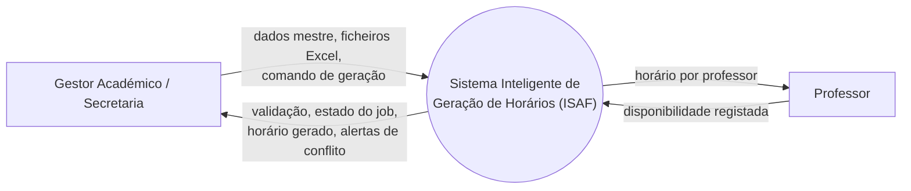

# 1. Diagrama de Contexto
> Parte da Modelagem do Sistema — TFC ISAF. Ver índice geral em [`../modelagem_sistema.md`](../modelagem_sistema.md).

**Estado:** ✅ Fundamentação e aplicação concluídas

---

## 1.1 Definição

O Diagrama de Contexto é o nível mais alto (nível 0) de um Diagrama de Fluxo de Dados (DFD), representando **todo o sistema como um único processo**, envolto pelas entidades externas com as quais troca informação<cite index="9-1">, sendo composto por fluxos de dados que mostram as interfaces entre o sistema e as entidades externas, permitindo identificar os limites dos processos, as áreas envolvidas e os relacionamentos com elementos externos à organização</cite>. A referência académica citada para esta definição formal é [@vazquezsimoes2016], *Engenharia de Requisitos: Software Orientado ao Negócio*.

A tradição de onde este diagrama nasce é a **Análise Estruturada** (DeMarco/Yourdon): o diagrama de contexto é o ponto de partida do modelo funcional, antecedendo a decomposição em DFDs de nível 1, 2, etc. Este é o mesmo referencial usado no material de Engenharia de Requisitos/Análise de Sistemas em uso corrente (Anhanguera, UFMG), o que o torna um artefacto reconhecível por qualquer júri de TFC.

Note-se que o Diagrama de Contexto é historicamente um artefacto de **Análise Estruturada**, não UML — mas é aceite e exigido pelo modelo institucional do ISAF (`Modelo_TFC_IGF_1.pdf`) como o primeiro artefacto da secção de Modelagem, funcionando como ponte entre os Requisitos e os diagramas UML propriamente ditos (Casos de Uso, Classes, etc.).

## 1.2 Regras de Construção

1. **Um único processo central** — o sistema inteiro é representado por uma única figura, sem decomposição interna. Não se desenha nenhum módulo, classe ou subsistema.
2. **Entidades externas** — pessoas, papéis, sistemas ou organizações fora da fronteira do sistema. Desenhadas como retângulos/ovais rotulados à volta do processo central.
3. **Fluxos de dados rotulados** — cada seta é nomeada com um substantivo/expressão curta identificando *o que* flui (ex.: "dados de disponibilidade"), nunca uma ação de interface (ex.: "clique no botão").
4. **Sem depósitos de dados (data stores)** — ao contrário dos níveis inferiores do DFD, o diagrama de contexto não representa bases de dados internas.
5. **Fronteira do sistema explícita** — o limite entre "dentro" e "fora" do sistema deve ser inequívoco.
6. **Poucos elementos, alto nível de abstração** — recomenda-se não ultrapassar ~6-7 entidades externas; excesso de elementos indica mistura de nível de detalhe que pertence aos Casos de Uso.
7. **Rótulos orientados a propósito, não a tecnologia** — evitar termos como "API" ou "Base de Dados"; usar termos de negócio.

## 1.3 Fontes

- [@vazquezsimoes2016] — base académica da definição formal.
- **Tradição de Análise Estruturada (DeMarco/Yourdon)** — confirma o diagrama de contexto como DFD de nível 0, antecedendo a decomposição funcional.
- **Visual Paradigm — "Comprehensive Guide to System Context Diagrams"** (blog oficial) — define os 4 elementos obrigatórios (Sistema, Entidades Externas, Interações, Fronteira).
- **Visual Paradigm — tutorial de DFD multi-nível** — confirma na prática que o diagrama de contexto é sempre o primeiro nível, sem data stores.

> O Diagrama de Contexto não tem uma especificação formal única como a spec OMG UML tem para Casos de Uso — é consolidado por prática de mercado + literatura de Engenharia de Requisitos. As fontes acima são complementares, não conflituantes.

## 1.4 Aplicação ao Projeto ISAF

**Entidades externas** (retiradas de `analise_requisitos.md`, Secção 1 — Atores):

| Entidade Externa | Natureza da troca com o sistema |
|---|---|
| Gestor Académico / Secretaria | Único ator humano com permissões de escrita: cadastra dados mestre, importa ficheiros Excel, dispara a geração, consulta e valida o horário |
| Professor | Ator humano de escrita restrita: regista a própria disponibilidade; consulta o seu horário |

O **Motor CP-SAT** e o **backend FastAPI** não aparecem como entidades externas — são parte do processo único "Sistema", por definição da regra 1.2.1 (um único processo central, sem decomposição interna nesta fase).

**Fluxos de dados identificados** (mapeados diretamente aos RF01–RF13):

- Gestor → Sistema: dados mestre (Professores, Turmas, Disciplinas, Salas), ficheiros Excel para importação em massa, comando de disparo de geração de horário
- Sistema → Gestor: confirmação/erros de validação de importação, estado de processamento (Job ID / polling), horário gerado, alertas de cenário sem solução viável
- Professor → Sistema: disponibilidade registada
- Sistema → Professor: horário por professor (consulta)

> Nota: o bloco Mermaid acima é renderizado automaticamente pelo GitHub — útil já que este repositório de documentos vivos vai ser hospedado lá. Para o TFC em si (PDF/Word final), o diagrama definitivo deve ser desenhado no **Visual Paradigm**, seguindo exatamente estas entidades e fluxos, para consistência de notação com os restantes diagramas (Casos de Uso, Classes) que também serão produzidos na mesma ferramenta.

**Observação de coerência:** confirma-se que não há qualquer terceira entidade externa (ex. "Administrador de Sistema") — decisão já fechada em `analise_requisitos.md` (ator único). Isto simplifica o diagrama e reforça, no próprio capítulo de modelagem, a decisão de arquitetura tomada na análise de requisitos.