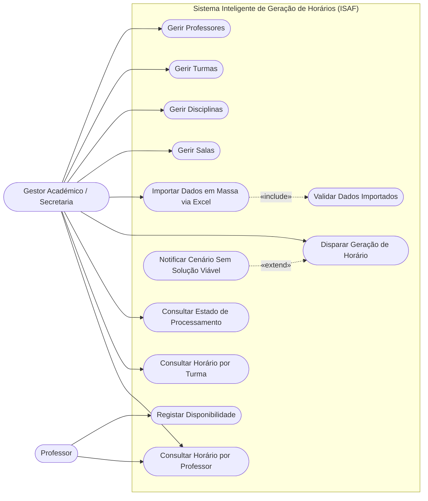

# 2. Diagrama de Casos de Uso
> Parte da Modelagem do Sistema — TFC ISAF. Ver índice geral em [`../modelagem_sistema.md`](../modelagem_sistema.md).

**Estado:** ✅ Fundamentação e aplicação concluídas

---

## 2.1 Definição

Ao contrário do Diagrama de Contexto (Análise Estruturada), o Diagrama de Casos de Uso é um artefacto **UML formal**, com definição própria na especificação da OMG (Object Management Group). Segundo a *UML Specification* (versões 2.4.1/2.5.1):

- **Ator** — modela um tipo de papel desempenhado por uma entidade (pessoa, sistema ou máquina) que interage com o sistema, mas que lhe é externa. O termo "papel" é usado de forma informal: um ator nunca é uma pessoa concreta (ex. "Dr. João"), mas sim o papel que essa pessoa desempenha (ex. "Professor").
- **Caso de Uso** — especifica um comportamento do sistema (o "assunto"/*subject*) que produz um resultado observável e de valor para um ou mais atores.
- **Sistema / Subject** — o classificador cujo comportamento está a ser descrito; visualmente representado por um retângulo ("fronteira do sistema"), com os casos de uso (elipses) desenhados no seu interior e os atores fora dele.

A referência académica de língua portuguesa mais utilizada neste contexto — e amplamente citada em TFCs/TCCs de Informática de Gestão na região (incluindo, muito provavelmente, os trabalhos do António, Edmilson e Cristiano usados como referência de qualidade) — é [@guedes2011], que define o Diagrama de Casos de Uso como o diagrama que, através de uma linguagem simples, demonstra o comportamento externo do sistema numa perspetiva do utilizador, evidenciando as funções e serviços oferecidos e que atores podem utilizá-los. Guedes reforça que este é o diagrama **mais abstrato, flexível e informal de toda a UML**, utilizado tipicamente no início da modelagem — o que justifica academicamente a ordem que já vínhamos a seguir (Contexto → Casos de Uso → Classes...).

## 2.2 Regras de Construção

1. **Ator é papel, não pessoa** — nunca nomear um ator com um indivíduo concreto; usar o papel (ex. "Professor", "Gestor Académico/Secretaria").
2. **Notação do ator** — figura em "boneco de palito" (stick figure) fora da fronteira do sistema, segundo a notação padrão definida na spec UML.
3. **Fronteira do sistema (system boundary)** — retângulo rotulado com o nome do sistema; todos os casos de uso ficam desenhados no seu interior; os atores ficam sempre fora.
4. **Nomenclatura dos casos de uso** — verbo + objeto, orientado ao objetivo do ator (ex. "Registar Disponibilidade", "Disparar Geração de Horário"), nunca um passo técnico de implementação (ex. "Gravar na tabela professor_disponibilidade" está errado).
5. **Associação (association)** — linha sólida entre ator e caso de uso, indicando participação/comunicação entre ambos.
6. **Relação de inclusão (`<<include>>`)** — seta tracejada do caso de uso base para o caso de uso incluído; indica **obrigatoriedade**: sempre que o caso base é executado, o incluído também é. Usa-se para comportamento partilhado/obrigatório entre vários casos de uso (ex. "Validar Dados Antes da Gravação" pode ser incluído por vários fluxos de importação).
7. **Relação de extensão (`<<extend>>`)** — seta tracejada do caso de uso que estende para o caso de uso base, associada a um ponto de extensão; indica comportamento **opcional ou condicional** — só executa sob determinada condição (ex. "Notificar Cenário Sem Solução Viável" pode estender "Disparar Geração de Horário" apenas quando o solver devolve INFEASIBLE).
8. **Generalização** — linha sólida com seta de triângulo vazado; usada quando um ator ou caso de uso é uma especialização de outro (não previsto para já no ISAF, dado o ator único confirmado, mas a regra fica registada).
9. **Granularidade** — um caso de uso deve representar um objetivo completo e de valor observável para o ator, nunca um passo isolado sem valor de negócio próprio. Este é o critério que vamos usar para decidir se, por exemplo, "Importar Excel" é um único caso de uso ou se se desdobra por entidade (Professores, Turmas, Disciplinas, Salas), alinhado com RF06.
10. **Nível de detalhe** — o diagrama fica deliberadamente no nível alto; o detalhe passo-a-passo (pré-condições, pós-condições, fluxo principal/alternativo) fica reservado para o próximo artefacto da nossa sequência: a **Especificação Textual dos Casos de Uso**.

## 2.3 Fontes

- [@omguml] — definições formais de Ator, Caso de Uso, Subject/Sistema, Associação, Include e Extend; fonte primária e normativa da UML.
- [@guedes2011] — referência académica de língua portuguesa amplamente adotada em trabalhos de fim de curso na área de Informática de Gestão, com estudo de caso completo de aplicação prática dos diagramas.
- [@umldiagrams_org] — consolidação didática baseada diretamente na especificação UML 2.5, usada como apoio complementar à leitura da spec formal da OMG.
- [@visualparadigm_usecase] — procedimento prático de construção na ferramenta adotada: criação da fronteira do sistema (System), atores, casos de uso e relações via Resource Catalog.

> Nota de coerência com o diagrama anterior: o Diagrama de Contexto tratou o sistema como uma "caixa preta" com fluxos de dados de alto nível; o Diagrama de Casos de Uso mantém os mesmos atores (Gestor Académico/Secretaria, Professor — sem introduzir um terceiro), mas decompõe a fronteira nas funcionalidades concretas que cada um pode acionar, mapeadas diretamente aos RF01–RF14 já validados em `analise_requisitos.md`.

## 2.4 Aplicação ao Projeto ISAF

### 2.4.1 Atores

Mantidos exatamente os mesmos do Diagrama de Contexto — nenhum terceiro ator é introduzido, por coerência com a decisão já fechada em `analise_requisitos.md` (Secção 1):

| Ator | Papel no Diagrama de Casos de Uso |
|---|---|
| **Gestor Académico / Secretaria** | Ator principal — aciona praticamente todos os casos de uso de gestão, importação, geração e consulta |
| **Professor** | Ator secundário — regista a própria disponibilidade e consulta o seu próprio horário |

O **Motor CP-SAT** não é modelado como ator: continua a ser tratado como parte interna do "Sistema" (o *subject*), coerente com a decisão já tomada no Diagrama de Contexto (regra: um único processo/fronteira, sem decomposição interna nesta fase de modelagem).

### 2.4.2 Casos de Uso identificados (mapeados a RF01–RF14)

| UC | Nome do Caso de Uso | RF de origem | Ator(es) | Relação |
|---|---|---|---|---|
| UC01 | Gerir Professores | RF01 | Gestor | — |
| UC02 | Gerir Turmas | RF02 | Gestor | — |
| UC03 | Gerir Disciplinas | RF03 | Gestor | — |
| UC04 | Gerir Salas | RF04 | Gestor | — |
| UC05 | Registar Disponibilidade | RF05 | Professor | — |
| UC06 | Importar Dados em Massa via Excel | RF06 | Gestor | inclui UC07 |
| UC07 | Validar Dados Importados | RF07 | Gestor | incluído por UC06 (`<<include>>`) |
| UC08 | Disparar Geração de Horário | RF09 | Gestor | estendido por UC09 |
| UC09 | Notificar Cenário Sem Solução Viável | RF13 | Gestor | estende UC08 (`<<extend>>`) |
| UC10 | Consultar Estado de Processamento | RF10 | Gestor | — |
| UC11 | Consultar Horário por Turma | RF11 | Gestor | — |
| UC12 | Consultar Horário por Professor | RF12 | Gestor, Professor | — |

### 2.4.3 Decisões de modelagem (justificação, regra 2.2.9 — granularidade)

- **RF06 tratado como um único caso de uso**, e não desdobrado em 4 (um por entidade), ao contrário do CRUD (RF01–04, que são 4 RFs distintos na análise de requisitos). Justificação: a análise de requisitos regista RF06 como **um único requisito** ("por entidade" é um modificador de implementação, não 4 objetivos de negócio distintos do ator). Manter o diagrama no nível de abstração correto (regra 2.2.10).
- **RF07 modelado como `<<include>>` de UC06**, porque a validação é uma etapa **obrigatória** do fluxo de importação (fluxo validar → confirmar, conforme já fechado em `analise_requisitos.md`) — corresponde exatamente à definição formal de *include* na spec UML (execução sempre conjunta).
- **RF13 modelado como `<<extend>>` de UC08**, porque a notificação de cenário sem solução viável só ocorre **condicionalmente** (quando o solver não consegue satisfazer 100% as restrições) — corresponde à definição formal de *extend* (comportamento opcional, ativado sob condição).
- **RF08 (idempotência da reimportação) não aparece como caso de uso próprio.** É uma regra de negócio interna ao comportamento de UC06 (Importar Dados em Massa), sem valor observável autónomo para o ator — por isso fica reservada para detalhe na **Especificação Textual dos Casos de Uso** (próximo artefacto, `03_especificacao_casos_uso.md`), e não infringe a regra de granularidade (2.2.9).
- **RF14 (reotimização) não aparece no diagrama.** Está formalmente classificado como Trabalho Futuro em `analise_requisitos.md` (Secção 2, confirmado 07/07) — mantê-lo fora do diagrama atual é coerente com essa decisão e evita sugerir, ao júri, um escopo que não foi implementado nesta fase do TFC. Fica registada aqui a decisão para rastreabilidade.

### 2.4.4 Diagrama

> Nota: a Mermaid não tem um tipo de diagrama UML de Casos de Uso nativo (ao contrário do que oferece para diagramas de sequência, por exemplo); a representação acima usa nós em forma de "stadium" para simular as elipses UML e é suficiente para rastreio visual no GitHub. **O diagrama formal e definitivo, com a notação UML correta (elipses, boneco de palito, fronteira retangular, setas `<<include>>`/`<<extend>>`), deve ser produzido no Visual Paradigm** para constar no documento final do TFC — seguindo exatamente os atores, casos de uso e relações acima definidos.

---