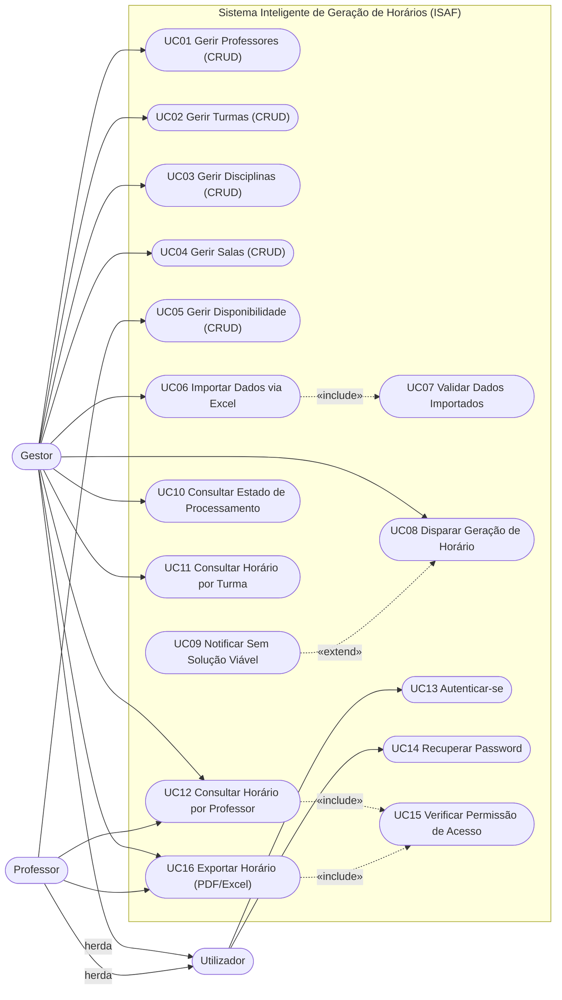

# 2. Diagrama de Casos de Uso
> Parte da Modelagem do Sistema — TFC ISAF.
> Ver índice em [`../modelagem_sistema.md`](../modelagem_sistema.md) | Fonte de verdade: [`../analise_requisitos.md`](../analise_requisitos.md) Secção 5.

**Estado:** ✅ Versão final — 15/07

---

## 2.1 Definição

O Diagrama de Casos de Uso é um artefacto UML formal (OMG UML 2.5.1) que demonstra o comportamento externo do sistema na perspectiva do utilizador, evidenciando as funções e serviços oferecidos e os actores que podem utilizá-los (Guedes, 2011). É o diagrama mais abstracto da UML — representa o **quê**, não o **como**.

---

## 2.2 Decisões de Modelação

### Generalização de actores
O sistema tem dois actores humanos que partilham um comportamento comum: autenticação. Em vez de repetir setas para UC13 em cada actor, adopta-se a **generalização UML**:

```
        Utilizador
        /         \
  Gestor         Professor
```

`Utilizador` é o actor-pai. Associa-se a UC13 (Autenticar-se) e UC14 (Recuperar Password). `Gestor` e `Professor` herdam este comportamento automaticamente — sem setas repetidas no diagrama.

**Fonte:** OMG UML Specification 2.5.1, §18.1 — Actor generalization.

### Autenticação como pré-condição, não seta
Autenticação não é modelada como `<<include>>` universal partindo de cada UC. É uma **pré-condição textual** documentada na Especificação de cada caso de uso. Modelar `<<include>>` de UC13 para todos os outros UCs é um anti-padrão explicitamente desaconselhado (Bittner & Spence, 2002).

### UC15 — Verificar Permissão de Acesso
UC12 e UC16 são partilhados entre Gestor e Professor, mas com níveis de acesso diferentes (RN11):
- Gestor: acede a qualquer Professor/Turma
- Professor: acede apenas ao seu próprio horário

A verificação é obrigatória → `<<include>>` (não `<<extend>>`).

### UC09 — Notificar Sem Solução Viável
Comportamento **condicional** — só ocorre se o solver retornar INFEASIBLE. Modelado como `<<extend>>` de UC08 (não `<<include>>`).

---

## 2.3 Actores

| Actor | Natureza | UCs directos |
|---|---|---|
| Utilizador | Actor pai (generalização) | UC13, UC14 |
| Gestor | Herda Utilizador | UC01–UC04, UC06, UC08–UC12, UC16 |
| Professor | Herda Utilizador | UC05, UC12, UC16 |
| Firebase Auth | Entidade externa (no Diagrama de Contexto, não no de Casos de Uso) | — |

---

## 2.4 Casos de Uso

| UC | Nome | RF | Ator(es) | Relação |
|---|---|---|---|---|
| UC01 | Gerir Professores (CRUD) | RF01 | Gestor | — |
| UC02 | Gerir Turmas (CRUD) | RF02 | Gestor | — |
| UC03 | Gerir Disciplinas (CRUD) | RF03 | Gestor | — |
| UC04 | Gerir Salas (CRUD) | RF04 | Gestor | — |
| UC05 | Gerir Disponibilidade (CRUD) | RF05 | Professor | — |
| UC06 | Importar Dados via Excel | RF06 | Gestor | `<<include>>` → UC07 |
| UC07 | Validar Dados Importados | RF07 | Sistema interno | incluído por UC06 |
| UC08 | Disparar Geração de Horário | RF09 | Gestor | `<<extend>>` ← UC09 |
| UC09 | Notificar Sem Solução Viável | RF13 | Sistema interno | estende UC08 |
| UC10 | Consultar Estado de Processamento | RF10 | Gestor | — |
| UC11 | Consultar Horário por Turma | RF11 | Gestor | — |
| UC12 | Consultar Horário por Professor | RF12 | Gestor, Professor | `<<include>>` → UC15 |
| UC13 | Autenticar-se | RF15 | Utilizador | pré-condição de todos os outros |
| UC14 | Recuperar Password | RF16 | Utilizador | — |
| UC15 | Verificar Permissão de Acesso | RN11 | Sistema interno | incluído por UC12, UC16 |
| UC16 | Exportar Horário (PDF/Excel) | RF18 | Gestor, Professor | `<<include>>` → UC15 |

---

## 2.5 Relações estruturais

```
UC06 ──<<include>>──→ UC07   validação obrigatória na importação
UC08 ←──<<extend>>── UC09   notificação condicional (só se INFEASIBLE)
UC12 ──<<include>>──→ UC15   verificação de permissão obrigatória
UC16 ──<<include>>──→ UC15   verificação de permissão obrigatória
```

---

## 2.6 Diagrama (Mermaid — preview GitHub)



> **Nota:** diagrama definitivo em notação UML formal (generalização com triângulo, bonecos de palito, elipses) deve ser produzido no **Visual Paradigm** seguindo exactamente estes actores, UCs e relações. O Diagrama de Contexto exportado do VP (PDF já entregue) é a figura 2 do relatório.

---

## 2.7 Fontes

- **OMG.** *UML Specification* 2.5.1 — Actor, Use Case, generalization, include, extend.
- **Guedes, G. T. A. (2011).** *UML 2: Uma abordagem prática* (2ª ed.). Novatec.
- **Bittner, K.; Spence, I. (2002).** *Use Case Modeling*. Addison-Wesley — anti-padrão de include universal para autenticação.
