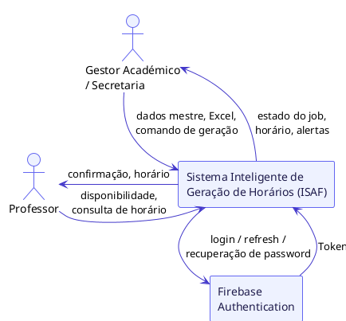
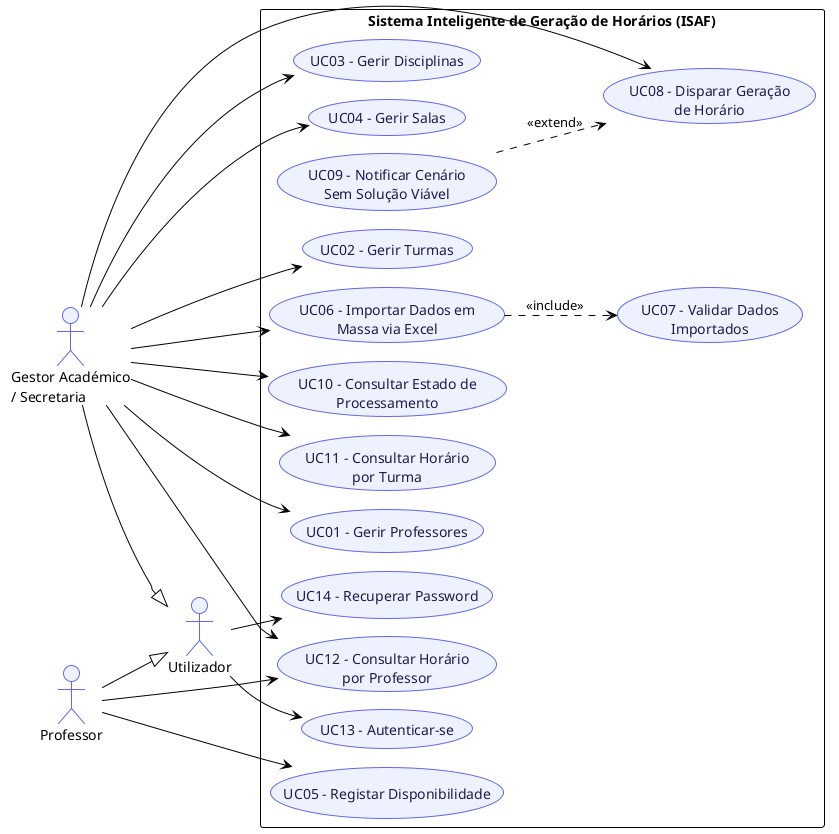
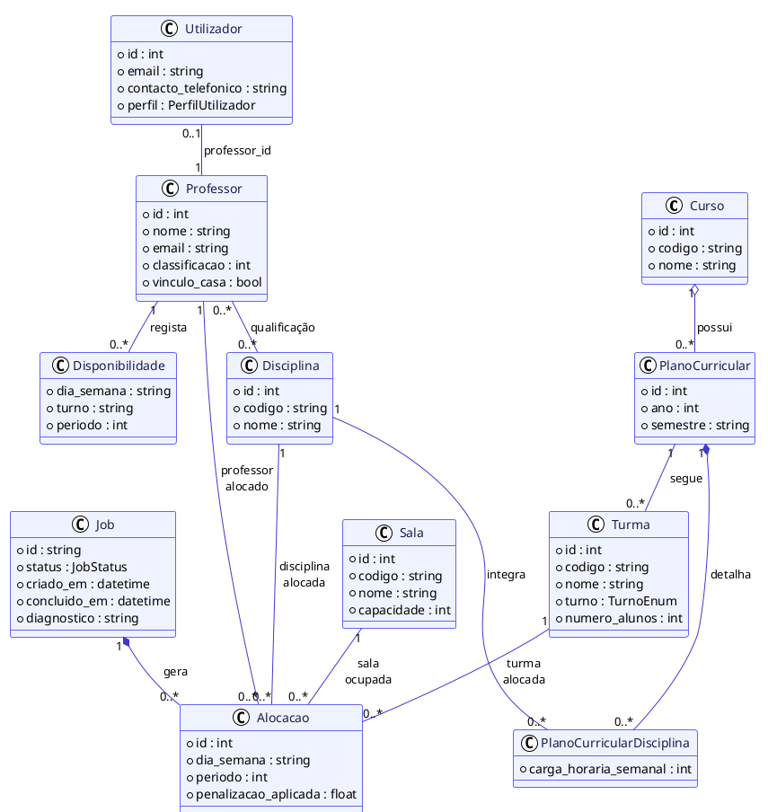
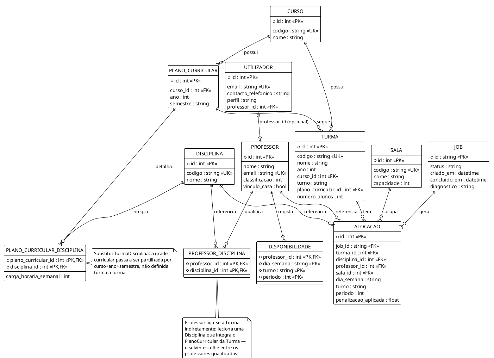

# 4. ANÁLISE, DESENVOLVIMENTO E DISCUSSÃO DOS RESULTADOS

Este capítulo apresenta o percurso técnico e analítico do
desenvolvimento do sistema, estruturado em seis secções que cobrem desde
o levantamento de requisitos até à discussão crítica dos resultados
obtidos. A sequência adoptada é coerente com a metodologia RUP descrita
na Secção 3.9.2 e com os princípios de engenharia de requisitos
estabelecidos na Secção 3.

## **4.1 Levantamento de requisitos**

O levantamento de requisitos constitui a etapa fundacional do
desenvolvimento de qualquer sistema de software. Seguindo os critérios
de qualidade da norma IEEE 830 --- correcta, completa, clara,
consistente, modificável, priorizada, verificável e rastreável --- os
requisitos do sistema foram elicitados a partir das entrevistas
realizadas com a gestão académica do ISAF, da análise documental dos
horários vigentes e da revisão da literatura científica sobre o UCTP
[@ieee830; @isoiec29148].

De acordo com a norma ISO/IEC/IEEE 29148:2011, os requisitos de sistemas
e software devem expressar necessidades, propriedades esperadas e
especificações verificáveis ao longo do ciclo de vida do produto
[@isoiec29148]. Neste trabalho, a necessidade central identificada
é a seguinte: a gestão pedagógica do ISAF necessita de gerar horários
académicos de forma automática, eliminando os conflitos de alocação de
docentes e salas que ocorrem no processo manual actualmente utilizado. A
propriedade esperada determina que o motor algorítmico opere sob
princípios de inteligência artificial simbólica, nomeadamente resolução
de restrições por CSP/CP, rejeitando aproximações probabilísticas que
comprometam a integridade e a verificabilidade dos horários produzidos.
A especificação é documentada nas tabelas de requisitos funcionais e não
funcionais que se seguem.

### **4.1.1 Glossário técnico**

Seguindo a directriz de modificabilidade da norma IEEE 830, que
recomenda a utilização de glossário para evitar ambiguidades e
redundâncias ao longo da especificação, apresenta-se de seguida a
definição formal dos termos técnicos utilizados neste capítulo (IEEE,
1998).

  -----------------------------------------------------------------------
  Termo                Definição
  -------------------- --------------------------------------------------
  CB-CTT               Curriculum-Based Course Timetabling --- paradigma
                       de alocação onde os alunos estão agrupados em
                       turmas fixas e imutáveis, sendo os conflitos
                       determinados pelo currículo publicado pela
                       instituição.

  CP-SAT Solver        Motor de Programação por Restrições puramente
                       integral desenvolvido pela Google, construído
                       sobre um solver SAT com Lazy Clause Generation,
                       utilizado como núcleo do motor de optimização do
                       sistema.

  Hard Constraint (HC) Restrição rígida cuja violação torna o horário
                       inválido. A sua satisfação total é condição
                       obrigatória para a viabilidade da solução.

  Soft Constraint (SC) Restrição flexível cuja satisfação é desejável,
                       mas não imprescindível. A sua violação penaliza a
                       qualidade da solução, mas não a invalida.

  Modelagem Esparsa    Técnica em que as variáveis de decisão são
                       instanciadas apenas para as combinações
                       previamente validadas como possíveis, excluindo
                       explicitamente relações irreais para poupar
                       capacidade de processamento.

  Variável de Folga    Recurso matemático que permite ao algoritmo
  (Slack Variable)     colocar uma aula \'de lado\' quando é impossível
                       alocá-la, pagando uma penalidade na função
                       objectivo em vez de travar o sistema.

  Tempo Lectivo        Unidade mínima e indivisível de alocação escolar,
                       equivalente à 45 minutos. Dois tempos lectivos
                       consecutivos formam um bloco de 90 minutos.

  Job ID               Identificador único atribuído a uma tarefa de
                       geração de horário quando o tempo de processamento
                       estimado ultrapassa 5 segundos. Permite ao cliente
                       fazer polling assíncrono sem bloquear a conexão
                       HTTP.
  -----------------------------------------------------------------------

*Tabela 1 --- Glossário técnico do sistema*

### **4.1.2 Requisitos de negócio**

Segundo [@vazquezsimoes2016], Requisitos (ou necessidades) de negócio
são declarações de mais alto nível de objetivos, metas ou necessidades
da organização. Eles descrevem as razões pelas quais um projeto foi
iniciado, as metas que o projeto deve atingir e as métricas que serão
utilizadas para aferir o seu sucesso. Requisitos de negócio descrevem
necessidades da organização como um todo e não de grupos ou partes
interessadas. As necessidades de negócio representam os objetivos que
uma área busca alcançar.

  ------------------------------------------------------------------------
  ID      Tipo          Descrição Técnica e Impacto no Modelo
  ------- ------------- --------------------------------------------------
  RN01    HC            Um professor não pode ter duas ou mais alocações
                        no mesmo slot temporal. (Sem sobreposição de
                        docente).

  RN02    HC            Uma turma não pode ter mais do que uma disciplina
                        alocada no mesmo slot temporal. (Sem sobreposição
                        de turma).

  RN03    HC            Uma sala de aula física não pode comportar mais do
                        que uma turma em simultâneo no mesmo slot
                        temporal. (Sem sobreposição de espaço).

  RN04    SC            O professor deve ser alocado de acordo com a sua
                        disponibilidade registada. O desvio entre o slot
                        ideal e o alocado é penalizado na função objetivo.

  RN05    HC            A carga horária semanal total definida para cada
                        disciplina na matriz curricular da turma deve ser
                        cumprida integralmente pelo solver.

  RN06    Hard / Soft   Agrupamento de aulas em blocos: proibição absoluta
          Hybrid        de tempos isolados (1 slot livre no meio ou aulas
                        singulares). Cargas ímpares são divididas em
                        blocos de tamanho de decisão do solver (ex: 2+3).

  RN07    Lógica de     Docentes sem disponibilidade explicitamente
          Fallback      registada no sistema são tratados como totalmente
                        disponíveis, sem restrições base de slot.

  RN08    SC            Capacidade da Sala: Alocação preferencial na sala
                        adequada com capacidade mínima viável. Violação
                        permitida apenas com pesada penalização em
                        cenários limite.

  RN09    HC            Controlo de Acesso: Qualquer operação de escrita,
          (Segurança)   consulta restrita ou geração exige um ID Token
                        válido do Firebase no cabeçalho HTTP
                        (Authorization Bearer).

  RN10    HC            Ao registar conta, o email da conta Firebase do
          (Segurança)   Professor deve corresponder ao email do registo
                        criado previamente pelo Gestor --- caso contrário,
                        o backend devolve 403 e a conta não é associada.

  RN11    HC (Acesso)   O Gestor consulta e exporta o horário de qualquer
                        turma ou professor; o Professor só pode consultar
                        o seu próprio horário (UC15 --- Validar Nível de
                        Acesso).
  ------------------------------------------------------------------------

*Tabela 2 --- Requisitos de negócio*

### **4.1.3 Requisitos funcionais**

Os requisitos funcionais (RF) definem os serviços, comportamentos e
respostas que o sistema deve fornecer para satisfazer as necessidades
dos utilizadores e os objectivos do negócio. Em termos práticos,
descrevem aquilo que o sistema deve fazer, especificando operações,
entradas, saídas, regras de processamento e reacções a determinadas
situações. No contexto deste estudo, os requisitos funcionais incluem
tanto funções directamente visíveis ao utilizador --- como gerar
horários, validar disponibilidades e devolver relatórios --- como
comportamentos internos indispensáveis para assegurar a produção de uma
solução válida. Conforme assinala [@sommerville2011], estes requisitos
podem também explicitar comportamentos que o sistema não deve permitir,
nomeadamente situações que comprometam a coerência ou a viabilidade da
solução produzida.

  ---------------------------------------------------------------------------
  ID     Nome do Requisito Módulo          Descrição Detalhada / Critérios de
                                           Aceitação
  ------ ----------------- --------------- ----------------------------------
  RF01   CRUD de           Dados Mestre    Permitir a criação, leitura,
         Professores                       atualização e eliminação de
                                           registos de docentes no sistema.

  RF02   CRUD de Turmas    Dados Mestre    Permitir a gestão completa das
                                           turmas da instituição de ensino.

  RF03   CRUD de           Dados Mestre    Gerir o catálogo de disciplinas,
         Disciplinas                       associando cargas horárias
                                           semanais e requisitos base.

  RF04   CRUD de Salas     Dados Mestre    Gerir as salas de aula físicas,
                                           incluindo dados de capacidade e
                                           recursos específicos.

  RF05   Registo de        Dados Mestre    Interface para que o Professor
         Disponibilidade                   registe os seus slots de
                                           preferência e indisponibilidade
                                           para lecionar.

  RF06   Importação em     Importação      Importar dados mestre a partir de
         Massa (Excel)                     ficheiros Excel institucionais por
                                           entidade.

  RF07   Validação de      Importação      Validar a estrutura e integridade
         Importação                        dos dados importados antes da
                                           persistência (fluxo de
                                           pré-visualização e confirmação).

  RF08   Idempotência na   Importação      Ignorar registos já existentes
         Importação                        baseando-se em chaves de
                                           identificação únicas
                                           institucionais (prevenindo
                                           duplicados).

  RF09   Disparar Geração  Motor de        Disparar o processamento
         de Horário        Otimização      assíncrono do motor de otimização
                                           CP-SAT a partir dos dados
                                           consolidados.

  RF10   Consultar Estado  Motor de        Verificar o estado da execução da
         (Polling)         Otimização      geração (Em processamento,
                                           Concluído, Inviável) via Job ID.

  RF11   Consultar Horário Visualização    Apresentar a grelha de horários
         por Turma                         gerada filtrada por uma turma
                                           específica.

  RF12   Consultar Horário Visualização    Apresentar a agenda semanal de
         por Professor                     alocações de um determinado
                                           docente.

  RF13   Tratamento de     Motor de        O sistema deve informar
         Inviabilidade     Otimização      explicitamente as restrições que
                                           causaram o estado \'INFEASIBLE\'
                                           caso o modelo falhe.

  RF14   Alteração Manual  Edição Manual   Permitir alterar manualmente um
         (Reoptimização)                   slot sem invalidar ou recalcular o
                                           resto do horário gerado.

  RF15   Autenticação de   Segurança       Autenticação via Firebase
         Utilizadores                      Authentication para Gestores
                                           Académicos e Professores.
                                           Validação de ID Token no backend
                                           FastAPI.

  RF16   Recuperação de    Segurança       Recuperação self-service integrada
         Password                          com fluxo nativo do Firebase (link
                                           de reset por email).

  RF17   Sincronização com Integrações     Sincronizar os horários gerados
         Calendário                        com serviços de calendário
         Externo (Fora do                  externos, nomeadamente a Google
         Âmbito)                           Calendar API. Classificado como
                                           trabalho futuro e fora do âmbito
                                           de implementação e validação deste
                                           MVP (cf. Secção 4.4).
  ---------------------------------------------------------------------------

*Tabela 3 --- Requisitos Funcionais*

### **4.1.4 Requisitos não funcionais**

Os requisitos não funcionais (RNF) estabelecem as restrições e os
atributos de qualidade que condicionam a forma como o sistema executa os
seus serviços. Diferentemente dos requisitos funcionais, que se
concentram nas funções e comportamentos esperados, os requisitos não
funcionais incidem sobre aspectos como desempenho, eficiência,
interoperabilidade, escalabilidade, segurança e fiabilidade. Em muitos
casos, estes requisitos aplicam-se ao sistema como um todo e não a uma
funcionalidade isolada. Tal como destaca [@sommerville2011], a distinção
entre requisitos funcionais e não funcionais nem sempre é absoluta, pois
um requisito não funcional pode originar novos requisitos funcionais ou
impor restrições à sua implementação. No presente trabalho, os
requisitos não funcionais foram definidos de forma mensurável e
verificável, com o objectivo de assegurar que o sistema, além de gerar
horários válidos, o faça com qualidade técnica, robustez e adequação ao
contexto institucional do ISAF.

  --------------------------------------------------------------------------
  ID        Categoria          Descrição e Métrica de Sucesso
  --------- ------------------ ---------------------------------------------
  RNF01     Desempenho /       Capacidade de escalar eficientemente para
            Escalabilidade     100+ professores e 60+ turmas, utilizando
                               modelagem matemática esparsa para mitigar a
                               explosão combinatória no CP-SAT.

  RNF02     Usabilidade        Operação assíncrona para geração de horários
                               através de arquitetura baseada em Jobs e
                               Polling, garantindo que a interface permanece
                               responsiva.

  RNF03     Confiabilidade     Minimizar cenários sem solução (infeasible)
                               através da modelagem de restrições flexíveis
                               (soft) e garantir que falhas no solver nunca
                               ocorram de forma silenciosa.

  RNF04     Manutenibilidade   Isolamento arquitetural rigoroso do motor do
                               solver OR-Tools / CP-SAT em relação à camada
                               de API REST do FastAPI (Clean Core).

  RNF05     Portabilidade de   Aceitação de ficheiros de entrada no formato
            Dados              institucional Excel (.xlsx) padrão do ISAF
                               para mitigar fricção de migração.

  RNF06     Segurança          Garantia de segurança delegada ao Firebase
                               Authentication com 2 perfis base (Gestor e
                               Professor). O backend FastAPI atua sem
                               persistência de credenciais diretas, apenas
                               validando tokens criptográficos.

  RNF07     Persistência de    Utilização de um SGBD relacional transaccional
            Dados              (PostgreSQL) para garantir integridade
                               referencial e transaccional nas operações de
                               importação em massa, com esquema mapeado
                               directamente pelos modelos SQLModel. Suporte a
                               escrita concorrente é uma propriedade de
                               desenho do SGBD, não validada por teste de
                               carga dedicado neste trabalho.
  --------------------------------------------------------------------------

*Tabela 4 --- Requisitos Não Funcionais*

## **4.2 Modelagem do sistema**

A modelagem do sistema foi realizada com recurso à Unified Modeling
Language (UML), linguagem amplamente utilizada para especificar,
visualizar e documentar artefactos de sistemas orientados a objectos
[@boochrumbaughjacobson2005]. São apresentados os actores do
sistema, os casos de uso principais e a especificação formal do modelo
matemático que fundamenta o motor de optimização.

### **4.2.1 Diagrama de Contexto**

O Diagrama de Contexto é uma ferramenta gráfica utilizada para
representar as interacções entre um sistema e o seu ambiente externo,
definindo os limites do sistema e identificando as entidades externas
(actores) que com ele interagem, bem como os fluxos de dados que entram
e saem. Trata-se de uma visão de alto nível, pensada para simplificar a
compreensão do sistema e facilitar a comunicação entre as partes
interessadas.

O Diagrama de Contexto corresponde ao nível mais alto (nível 0) de um
Diagrama de Fluxo de Dados (DFD), representando todo o sistema como um
único processo, envolto pelas entidades externas com as quais troca
informação, através de fluxos de dados que mostram as interfaces entre o
sistema e essas entidades, permitindo identificar os limites dos
processos, as áreas envolvidas e os relacionamentos com elementos
externos à organização [@vazquezsimoes2016].

No caso do sistema proposto, identificam-se duas entidades externas
humanas --- o Gestor Académico/Secretaria e o Professor --- e uma
entidade externa não humana, o serviço Firebase Authentication,
responsável pela emissão e validação da identidade dos utilizadores. O
motor CP-SAT e o backend FastAPI não constituem entidades externas, por
serem componentes internos da fronteira do sistema.

Figura 1 --- Diagrama de contexto

### **4.2.2 Diagrama de Casos de Uso**

O Diagrama de Casos de Uso é um artefacto UML formal que demonstra o
comportamento externo do sistema na perspectiva do utilizador,
evidenciando as funções e serviços oferecidos e os actores que podem
utilizá-los [@guedes2011]. O sistema envolve dois actores humanos ---
Gestor Académico/Secretaria e Professor --- cujas responsabilidades e
interacções se encontram descritas na tabela seguinte, com
rastreabilidade directa aos requisitos funcionais.

  ---------------------------------------------------------------------------------
  ID     Caso de Uso       RF de    Ator/Interveniente      Relações / Notas de
                           Origem                           Modelação
  ------ ----------------- -------- ----------------------- -----------------------
  UC01   Gerir Professores RF01     Gestor                  Compreende o CRUD de
                                    Académico/Secretaria    docentes.

  UC02   Gerir Turmas      RF02     Gestor                  Compreende o CRUD de
                                    Académico/Secretaria    turmas.

  UC03   Gerir Disciplinas RF03     Gestor                  Compreende o CRUD de
                                    Académico/Secretaria    disciplinas.

  UC04   Gerir Salas       RF04     Gestor                  Compreende o CRUD de
                                    Académico/Secretaria    salas físicas e
                                                            capacidades.

  UC05   Registar          RF05     Professor               Permite ao docente
         Disponibilidade                                    submeter as suas
                                                            janelas e preferências
                                                            de horário.

  UC06   Importar Dados em RF06     Gestor                  Inclui UC07
         Massa via Excel            Académico/Secretaria    (\<\<include\>\>).
                                                            Importação unificada
                                                            por entidade.

  UC07   Validar Dados     RF07     Gestor                  Incluído por UC06
         Importados                 Académico/Secretaria    (\<\<include\>\>).
                                                            Execução obrigatória
                                                            para garantir
                                                            integridade.

  UC08   Disparar Geração  RF09     Gestor                  Estendido por UC09
         de Horário                 Académico/Secretaria    (\<\<extend\>\>).
                                                            Despoleta execução
                                                            assíncrona do CP-SAT.

  UC09   Notificar Cenário RF13     Gestor                  Estende UC08
         Sem Solução                Académico/Secretaria    (\<\<extend\>\>).
         Viável                                             Ocorre apenas se o
                                                            estado do solver for
                                                            INFEASIBLE.

  UC10   Consultar Estado  RF10     Gestor                  Polling assíncrono do
         de Processamento           Académico/Secretaria    processamento do solver
                                                            via Job ID.

  UC11   Consultar Horário RF11     Gestor                  Visualização
         por Turma                  Académico/Secretaria    estruturada do horário
                                                            escolar correspondente
                                                            a uma turma.

  UC12   Consultar Horário RF12     Gestor                  Acesso à agenda
         por Professor              Académico/Secretaria,   individual de aulas
                                    Professor               (multi-perfil).

  UC13   Login             RF15     Gestor                  Pré-condição
                                    Académico/Secretaria,   transversal aos
                                    Professor               restantes casos de uso
                                                            --- não representada
                                                            como \<\<include\>\>
                                                            gráfico, para evitar
                                                            poluição visual do
                                                            diagrama
                                                            [@bittnerspence2002];
                                                            representada em
                                                            alternativa por
                                                            generalização de actor
                                                            (Gestor e Professor
                                                            generalizam Utilizador,
                                                            que é quem liga a UC13
                                                            e UC14).

  UC14   Recuperar         RF16     Gestor                  Delegado inteiramente
         Password                   Académico/Secretaria,   ao mecanismo nativo do
                                    Professor               Firebase
                                                            Authentication.

  UC15   Validar Nível     RN11     Gestor                  Incluído
         de Acesso                  Académico/Secretaria,   (\<\<include\>\>) por
                                    Professor               UC12 --- restringe a
                                                            consulta ao horário do
                                                            próprio Professor
                                                            quando o actor não é
                                                            Gestor.
  ---------------------------------------------------------------------------------

Tabela 5 --- Casos de uso do sistema

Registam-se duas decisões de modelação relevantes. Em primeiro lugar, a
autenticação (UC13/UC14) não é representada graficamente como relação
\<\<include\>\> a partir de cada caso de uso: tratando-se de uma
pré-condição transversal, a sua representação por setas \<\<include\>\>
universais constitui um uso indevido das relações do diagrama,
explicitamente desaconselhado por [@bittnerspence2002]. Em vez disso,
o diagrama recorre a generalização de actor --- Gestor e Professor
generalizam um actor comum, Utilizador, que é quem se liga a UC13 e
UC14 --- e a validação de token em cada pedido HTTP (RN09) é, essa sim,
documentada apenas textualmente na especificação de cada caso de uso,
por ser uma verificação de infraestrutura (incluindo a expiração do
token) e não um comportamento observável adicional do actor. Já a
verificação de nível de acesso em UC12 (RN11 --- Professor só vê o seu
próprio horário) tem valor observável específico daquele caso de uso, e
é por isso modelada graficamente como UC15, incluída (\<\<include\>\>)
por UC12. Em segundo lugar, o requisito RF08 (idempotência) não origina
caso de uso próprio, por se tratar de regra de negócio interna ao
comportamento de UC06, sem valor observável autónomo para o actor. A
especificação textual completa dos casos de uso mais complexos
encontra-se no Apêndice B.

Figura 2 --- Diagrama de casos de uso

### **4.2.3 Diagrama de Classes**

O Diagrama de Classes é o diagrama estrutural central da UML,
representando as classes do sistema, os seus atributos, operações e
relacionamentos, e servindo de base lógica para a maioria dos demais
diagramas e para a própria estrutura da base de dados [@guedes2011].
Neste projecto, o Diagrama de Classes cumpre dupla função: artefacto de
modelação e esquema directo de persistência, uma vez que cada classe de
domínio corresponde a um modelo SQLModel no backend FastAPI, persistido
em PostgreSQL (RNF07).

Foram identificadas onze classes de domínio: Curso, Professor, Turma,
Disciplina e Sala (dados mestre, RF01--RF04); PlanoCurricular e
PlanoCurricularDisciplina (a grade curricular oficial — disciplinas e
carga horária semanal por curso, ano e semestre — partilhada por todas
as turmas desse ano, em vez de definida turma a turma); Disponibilidade
(RF05, associada por composição ao Professor); Utilizador (identidade —
liga, por email, uma conta
Firebase Authentication a um Gestor ou, opcionalmente, a um Professor já
registado, RF15/RN09/RN10); Job (a tarefa assíncrona do solver, RF09/RF10,
com estado e motivo de falha); e Alocacao (a saída do solver, associando
cada combinação turma-disciplina-professor a uma sala, dia e período —
o turno não é atributo próprio de Alocacao, por ser sempre igual ao da
Turma alocada, RN de normalização até à 3.ª Forma Normal). Uma Turma
segue sempre um único PlanoCurricular (RF02), do qual herda curso e ano
(também não repetidos em Turma pela mesma razão); o Professor liga-se à
Turma indirectamente — leciona uma Disciplina que integra o
PlanoCurricular dessa Turma, e é entre os professores assim
qualificados e disponíveis que o solver escolhe quem lecciona cada
turma (RNF01). A qualificação docente (Professor--Disciplina) é uma
associação muitos-para-muitos sem atributos próprios além das chaves
estrangeiras, pelo que não constitui classe de domínio própria no
diagrama conceptual — persiste, ainda assim, como tabela de junção
(ProfessorDisciplina) no esquema físico (secção 4.2.4).

Figura 3 --- Diagrama de classes

### **4.2.4 Diagrama Entidade-Relacional**

O Modelo Entidade-Relacionamento, proposto por [@chen1976], representa
os dados de um domínio como entidades, atributos e relacionamentos,
servindo de ponte entre o modelo conceptual e o esquema físico da base
de dados relacional. Enquanto o Diagrama de Classes modela a estrutura
orientada a objectos da aplicação, o DER modela a estrutura de
persistência --- neste projecto, o esquema PostgreSQL (RNF07), com
correspondência directa de uma tabela por classe de domínio persistente.

Destaca-se uma decisão de desenho: as restrições UNIQUE sobre o atributo
codigo (ou email, no caso de Professor e Utilizador) de cada entidade de
dados mestre implementam directamente a chave de idempotência da
importação (RF08). A regra RN03 (sala sem dupla turma no mesmo tempo) é
garantida matematicamente pelo solver (secção 4.3.3) — não existe, para
já, uma restrição UNIQUE composta redundante ao nível da base de dados
sobre a tabela de alocações; fica identificada como melhoria futura de
defesa em profundidade.

Figura 4 --- Diagrama entidade-relacional

## **4.3 Arquitectura da solução**

O sistema adoptou uma arquitectura de três camadas com separação
rigorosa de responsabilidades, em alinhamento com os princípios de
Clean Architecture [@martin2017]. Esta separação garante que a lógica
matemática do solver é
independente da camada de comunicação HTTP e da camada de apresentação,
facilitando a manutenção, a substituição de componentes e a
escalabilidade futura.

### **4.3.1 Camada de apresentação (Flutter)**

A interface de utilizador foi desenvolvida em Flutter, adoptando Clean
Architecture com separação em três sub-camadas internas: Presentation
(widgets e páginas), Domain (entidades e casos de uso) e Data
(repositórios e modelos de deserialização JSON). Esta estrutura permite
que a interface seja independente da implementação do backend,
comunicando exclusivamente através de contratos JSON definidos pelo
endpoint /gerar-horario da API.

### **4.3.2 Camada de integração (FastAPI)**

O backend foi implementado em Python com FastAPI, responsável pela
validação dos payloads de entrada, pela orquestração das chamadas ao
motor de optimização e pela devolução de respostas estruturadas em JSON.
Para satisfazer o RNF02 (escalabilidade assíncrona), foi implementado um
padrão de Job Queue: quando o tempo de processamento estimado ultrapassa
5 segundos, a API devolve imediatamente um Job ID e o cliente realiza
polling no endpoint /status/{job_id} até à conclusão do cálculo,
evitando o bloqueio da conexão HTTP.

A camada de integração é ainda responsável pela persistência dos dados
académicos em PostgreSQL, através de modelos SQLModel que espelham as
classes de domínio definidas na Secção 4.2.3, garantindo integridade
transaccional nas operações de importação em massa (RF06--RF08) e
suporte a escrita concorrente em ambiente de hospedagem (RNF07).

### **4.3.3 Camada de optimização (CP-SAT Solver)**

O núcleo do sistema é o motor de optimização implementado em Python com
Google OR-Tools CP-SAT. Esta camada recebe o problema formalizado como
CSP, instância as variáveis de decisão de acordo com a modelagem esparsa
(RNF01), adiciona as restrições rígidas e flexíveis ao modelo, e invoca
o solver. O resultado é devolvido como um objecto estruturado que a
camada FastAPI serializa em JSON para consumo pela interface Flutter.
Caso o solver devolva o status INFEASIBLE --- indicando que o conjunto
de restrições é matematicamente irresolvível --- o motor activa o
mecanismo de diagnóstico (RF13): uma verificação estrutural leve,
executada antes de qualquer nova resolução, que testa as causas mais
comuns de inviabilidade (ausência de professor qualificado para uma
disciplina, número de alunos da turma a exceder a capacidade de todas
as salas disponíveis, ou carga horária semanal incompatível com o
tamanho mínimo de bloco exigido pelo RN06) e devolve a causa
identificada em vez de falhar criticamente. Não recorre a variáveis de
folga (*slack variables*) nem a extracção do conjunto mínimo de
restrições em conflito via `SufficientAssumptionsForInfeasibility` do
CP-SAT --- ficando como melhoria futura (cf. Secção 5.2) para os casos
em que nenhuma das causas estruturais verificadas é identificada.

A sincronização dos horários gerados com serviços de calendário externos
(Google Calendar API) foi identificada como extensão de valor
acrescentado, mas encontra-se formalmente classificada como trabalho
futuro (RF17), não fazendo parte do âmbito de implementação e validação
deste MVP.

## **4.4 Implementação do sistema**

A implementação seguiu uma abordagem incremental e iterativa inspirada
no Rational Unified Process (RUP), com o desenvolvimento organizado em
módulos independentes e testáveis, por ordem de prioridade técnica e de
dependência entre componentes [@kruchten2003].

### **4.4.1 Módulo 1 --- Motor de Optimização (Core)**

O módulo central foi desenvolvido em primeiro lugar, de forma isolada,
para validar a lógica matemática sem dependências de framework.
Implementa a modelagem esparsa do CSP com Google OR-Tools CP-SAT, a
gestão das Hard Constraints (RN01, RN02, RN03 e RN05), a penalização das
Soft Constraints (RN04, RN06 e RN08) na função objectivo, e o mecanismo
de diagnóstico estrutural para inviabilidade (RF13, cf. Secção 4.3.3). A
arquitectura do modelo foi preparada para suportar, em iterações
futuras, o congelamento de alocações necessário à reoptimização
incremental (RF14, classificado como trabalho futuro). O código deste
módulo encontra-se reproduzido no Apêndice A.

### **4.4.2 Módulo 2 --- API REST (FastAPI)**

O segundo módulo implementa a camada de integração HTTP, expondo os
endpoints definidos no contrato de API: POST /gerar-horario (recebe o
payload de entidades académicas e acciona o solver), GET
/status/{job_id} (consulta o estado de uma tarefa assíncrona) e GET
/horario/{job_id} (obtém o resultado final em JSON estruturado). A
validação dos payloads de entrada utiliza modelos Pydantic, garantindo a
integridade dos dados antes da sua passagem ao motor de optimização.

### **4.4.3 Módulo 3 --- Interface Flutter**

A interface de utilizador foi implementada em Flutter com Clean
Architecture, disponibilizando os seguintes ecrãs principais:
autenticação de utilizadores (Firebase Authentication, RF15/RF16),
gestão de entidades académicas (docentes, turmas, disciplinas, salas),
registo de disponibilidade docente, visualização do horário gerado em
formato de grelha semanal, consulta do relatório de inviabilidade quando
aplicável, e exportação do horário em PDF. As capturas de ecrã do
sistema encontram-se no Apêndice C.

## **4.5 Testes e validação**

Em conformidade com a abordagem exploratória-descritiva definida na
Secção 3, a validação do sistema seguiu uma estratégia de cenários de
teste progressivos --- do cenário mínimo controlável até um cenário de
escala --- complementada por dois cenários de inviabilidade intencional,
destinados a verificar especificamente o mecanismo de diagnóstico
estrutural descrito na Secção 4.3.3 (RF13, RNF03). A suite de testes
automatizados totaliza 32 testes, cobrindo o motor de optimização, o
fluxo assíncrono de geração (RF09/RF10), a consulta estruturada de
horários (RF11/RF12), a importação em massa (RF06--RF08) e a
autenticação/autorização (RN09--RN11); a suite completa executa em
aproximadamente 15 segundos.

  ---------------------------------------------------------------------------
  ID     Cenário         Dimensão                    Critério de Aceitação
  ------ --------------- --------------------------- -------------------------
  CT01   Cenário mínimo  3 turmas, 3 disciplinas, 2  Status OPTIMAL/FEASIBLE;
         viável          professores, 1 sala         6 alocações geradas;
                                                     RN01--RN03, RN05 e RN06
                                                     satisfeitas.

  CT02   Cenário de      12 turmas, 6 disciplinas,   Status OPTIMAL/FEASIBLE
         escala          8 professores, 5 salas      em até 10s; RN01--RN03 e
                                                     RN05 satisfeitas sem
                                                     violação.

  CT03   Inviabilidade   1 turma, 1 disciplina, 1    Status INFEASIBLE;
         estrutural      professor, 1 sala, carga    diagnóstico identifica a
         intencional     semanal = 1                 causa estrutural (carga
                                                     incompatível com o bloco
                                                     mínimo do RN06); zero
                                                     alocações.

  CT04   Distinção entre Cenário de escala (CT02)    Status INFEASIBLE;
         esgotamento de  com tempo-limite reduzido   diagnóstico refere o
         tempo e         para 0,01s                  limite de tempo, sem
         inviabilidade                               reportar falsamente uma
         genuína                                     causa estrutural.

  CT05   Fluxo           Criação de entidades via    Job conclui com sucesso;
         ponta-a-ponta   API, POST /gerar-horario,   GET /horarios/turma/{id}
         (Golden Path)   polling do Job, consulta    e /horarios/professor/{id}
                         por turma e por professor   devolvem JSON estruturado
                                                     por dia/slot.

  CT06   Idempotência da Reimportação do mesmo       Registos já existentes
         importação      ficheiro institucional      são ignorados; nenhum
         Excel                                       registo duplicado é
                                                     criado na segunda
                                                     importação.
  ---------------------------------------------------------------------------

*Tabela 6 --- Cenários de Teste e Critérios de Aceitação*

O cenário CT01 corresponde ao critério mínimo de aceitação definido na
Secção 3.5.1 e foi o primeiro a ser validado, na Fase 3, antes de
qualquer dependência de framework ser introduzida. O cenário CT02,
introduzido na Fase 7, aumenta a dimensão do problema para 12 turmas
(cada uma com 30 alunos) e 8 professores --- dos quais 6 são
especialistas numa única disciplina e 2 partilham qualificação entre
duas disciplinas, testando a resolução de ambiguidade de alocação pelo
solver --- restringidos a um único turno (45 slots). Todos os testes
foram executados contra uma base de dados SQLite em memória, e não
contra o PostgreSQL utilizado em produção (cf. RNF07, Secção 4.1.4).

Os cenários CT03 e CT04 validam especificamente o mecanismo de
diagnóstico descrito na Secção 4.3.3. O CT03 força uma violação
estrutural do RN06 (uma disciplina com carga semanal de apenas 1 tempo
lectivo, incompatível com o tamanho mínimo de bloco de 2 tempos) e
verifica que o diagnóstico identifica correctamente essa causa. O CT04
verifica um requisito de correcção mais subtil: ao reduzir
artificialmente o tempo disponível ao solver para o cenário de escala
(CT02) para 0,01 segundos, o CP-SAT devolve um status que, sem
tratamento adequado, seria indistinguível de uma inviabilidade
estrutural genuína. O sistema distingue correctamente entre as duas
situações, evitando que um simples esgotamento do orçamento de tempo
seja reportado ao utilizador como uma revisão manual necessária.

## **4.6 Discussão dos resultados**

Os resultados obtidos confirmam a hipótese H1 (Secção 1.5) nos limites
testados: em todos os cenários matematicamente viáveis (CT01, CT02,
CT05), o motor produziu horários sem conflitos de professor, turma ou
sala (RN01--RN03), com a carga horária semanal integralmente cumprida
(RN05). O mecanismo de diagnóstico estrutural (CT03, CT04) cumpriu o
RNF03 ao garantir que nenhum cenário sem solução resulta em falha
silenciosa, incluindo o caso de fronteira --- esgotamento do tempo de
resolução --- que poderia ser confundido com uma inviabilidade real.

Dois limites da validação efectuada devem ser assinalados com rigor
científico. Primeiro, o cenário de maior escala testado (CT02, 12
turmas e 8 professores) fica substancialmente aquém do limite superior
formalmente definido pelo RNF01 (100+ professores, 60+ turmas); embora a
modelagem esparsa (Secção 2.4.3) sustente teoricamente a escalabilidade
do motor para instâncias maiores, essa extrapolação não foi validada
empiricamente neste trabalho. Segundo, na ausência de dados
institucionais reais e completos do ISAF (limitação já identificada na
Secção 5.1), não foi possível realizar a análise comparativa de
desempenho prevista na Secção 3.7 entre os horários gerados pelo motor
CP-SAT e os horários actualmente produzidos manualmente pela instituição
--- a validação obtida circunscreve-se, portanto, à correcção matemática
do motor face às restrições formalizadas, e não a uma medição directa do
ganho de eficiência face ao processo manual. Ambos os limites motivam as
recomendações apresentadas na Secção 5.2.