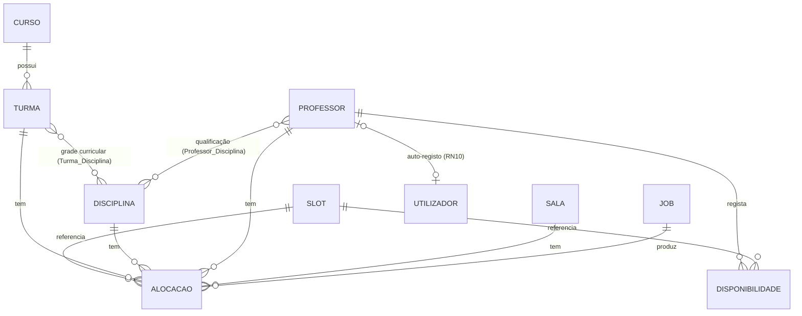

# Arquitetura do Backend — Sistema Inteligente de Geração de Horários (ISAF)
> Documento vivo de trabalho — acompanha `analise_requisitos.md`, `modelagem_sistema.md` e `05_diagrama_er.md`.
> Serve de especificação directa para implementação (handoff ao Claude Code).
> Stack obrigatória: **Python + FastAPI** (API), **Google OR-Tools CP-SAT** (motor de resolução), **Flutter** (frontend, fora deste documento). Nenhum desvio de stack é permitido (ver regras fixas do projeto).

---

## 1. Princípio Fundamental — BD ≠ Variáveis do Solver

As entidades da base de dados representam o **domínio do problema** (dados mestre, factos estáticos). O CP-SAT não lê a BD diretamente. O backend segue sempre este fluxo em três passos:

1. **Extração** — lê as entidades relevantes da BD para memória (objetos Python/Pydantic).
2. **Geração esparsa do modelo** — cria variáveis `BoolVar` do CP-SAT apenas para combinações válidas, filtradas pelas relações da BD (nunca modelagem densa — ver Cristiano_lourenco_ISAF.pdf, secção 2.4.3, Harshalatha et al., 2026).
3. **Persistência do resultado** — o output do solver é gravado de volta em entidades próprias (`Job`, `Alocacao`), que não existem enquanto dados de entrada.

Esta separação justifica academicamente RNF01 (escalabilidade) e RNF04 (manutenibilidade solver/API isolados).

---

## 2. Diagrama ER (referência — ver `05_diagrama_er.md` para versão fundamentada)



**Decisões de modelagem fechadas (07/07 e sessão atual):**
- `Semana` + `Horarios_Dia` fundidos num único `Slot` (dia_semana, tempo_ordem, hora_inicio, hora_fim) — corresponde ao conjunto formal `T` (|T| = 45) da definição UCTP (Abdipoor et al., 2023).
- `Ano` e `Período` não são tabelas — atributos de `Turma` (`ano_letivo`, `turno`).
- `Turma_Disciplina` (N:N) — grade curricular, corresponde ao conjunto de eventos `E` da definição formal.
- `Professor_Disciplina` (N:N) — qualificação docente, filtro obrigatório da modelagem esparsa.
- `Job` + `Alocacao` — entidades de output, ausentes na proposta inicial, obrigatórias para RF09–RF13.
- `Utilizador` (Fase 6, 15/07) — entidade introduzida para RN09/RN10, ausente da proposta inicial e do diagrama de classes original. Guarda **apenas** Gestores (`perfil=GESTOR`, criados exclusivamente pelo Superadmin) e Professores que completaram o auto-registo (`perfil=PROFESSOR`, `professor_id` associado). Superadmin **não** tem tabela própria — é uma lista de bootstrap em `Settings.superadmin_emails` (ver secção 5, Fase 6), decisão tomada por não existir ainda um mecanismo de provisionamento de Gestores anterior ao próprio sistema.

---

## 3. Estrutura de Pastas (Clean Architecture — solver isolado da API)

```
backend/
├── app/
│   ├── main.py                      # instancia FastAPI, inclui routers, middleware Firebase
│   ├── core/
│   │   ├── config.py                 # settings (env vars)
│   │   ├── security.py               # validação do Firebase ID Token (RN09 → 401)
│   │   └── database.py               # engine SQLite/SQLAlchemy, sessão
│   ├── models/                       # SQLModel — entidades ORM (mapeiam o ER)
│   │   ├── curso.py
│   │   ├── turma.py
│   │   ├── disciplina.py
│   │   ├── professor.py
│   │   ├── sala.py
│   │   ├── slot.py
│   │   ├── disponibilidade.py
│   │   ├── turma_disciplina.py       # associação N:N (grade curricular)
│   │   ├── professor_disciplina.py   # associação N:N (qualificação)
│   │   ├── job.py
│   │   └── alocacao.py
│   ├── schemas/                       # Pydantic — contratos de entrada/saída da API
│   │   ├── turma_schema.py
│   │   ├── horario_schema.py         # resposta de UC11/UC12, pronta para Flutter desserializar
│   │   └── job_schema.py
│   ├── repositories/                 # acesso a dados puro (CRUD), sem lógica de negócio
│   │   └── ...                       # um por entidade
│   ├── services/                      # lógica de negócio (RN01–RN09), orquestra repositórios
│   │   ├── importacao_service.py     # RF06/RF07/RF08 (Excel, validação, idempotência)
│   │   └── horario_service.py        # dispara job, consulta estado, consulta resultado
│   ├── solver/                        # ⚠️ ISOLADO — nunca importa FastAPI/routers
│   │   ├── builder.py                # gera variáveis esparsas
│   │   ├── constraints_hard.py       # RN01, RN02, RN03, RN05, RN06
│   │   ├── constraints_soft.py       # RN04, RN07, RN08 + função objetivo (5-C)
│   │   ├── solve.py                  # instancia CpModel, CpSolver, devolve resultado bruto
│   │   └── result_mapper.py          # traduz resultado do solver → entidades Alocacao
│   ├── api/
│   │   └── v1/
│   │       ├── routers/              # rotas finas — chamam services, nunca o solver diretamente
│   │       └── deps.py               # dependências (auth, sessão BD)
│   └── workers/
│       └── job_runner.py             # executa o solver em background, atualiza Job.status
├── tests/
├── requirements.txt
└── init_db.py                        # ou Alembic — ver Fase 1 (MVP: init simples)
```

**Regra inegociável para o Claude Code:** `solver/` nunca importa nada de `api/`. Comunicação unidirecional: `api → services → solver`. O solver recebe listas Python simples já filtradas, nunca sessões de BD.

---

## 4. Modelos SQLModel (referência de implementação)

```python
# app/models/slot.py
class Slot(SQLModel, table=True):
    id: int = Field(primary_key=True)
    dia_semana: str          # "segunda".."sexta"
    tempo_ordem: int         # 1..9
    hora_inicio: time
    hora_fim: time

# app/models/turma.py
class Turma(SQLModel, table=True):
    id: int = Field(primary_key=True)
    codigo: str = Field(unique=True)   # idempotência RF08
    nome: str
    ano_letivo: int
    turno: str
    numero_alunos: int
    curso_id: int = Field(foreign_key="curso.id")

# app/models/turma_disciplina.py — grade curricular (conjunto E da definição formal)
class TurmaDisciplina(SQLModel, table=True):
    turma_id: int = Field(foreign_key="turma.id", primary_key=True)
    disciplina_id: int = Field(foreign_key="disciplina.id", primary_key=True)
    carga_horaria_semanal: int   # nº de tempos/semana — usado em RN05 e RN06

# app/models/professor_disciplina.py — qualificação
class ProfessorDisciplina(SQLModel, table=True):
    professor_id: int = Field(foreign_key="professor.id", primary_key=True)
    disciplina_id: int = Field(foreign_key="disciplina.id", primary_key=True)

# app/models/disponibilidade.py
class Disponibilidade(SQLModel, table=True):
    professor_id: int = Field(foreign_key="professor.id", primary_key=True)
    slot_id: int = Field(foreign_key="slot.id", primary_key=True)

# app/models/job.py
class Job(SQLModel, table=True):
    id: str = Field(primary_key=True)   # uuid
    status: str                          # PENDING | RUNNING | DONE | INFEASIBLE
    criado_em: datetime
    concluido_em: Optional[datetime]

# app/models/alocacao.py — resultado persistido (RF11/RF12)
class Alocacao(SQLModel, table=True):
    id: int = Field(primary_key=True)
    job_id: str = Field(foreign_key="job.id")
    turma_id: int = Field(foreign_key="turma.id")
    disciplina_id: int = Field(foreign_key="disciplina.id")
    professor_id: int = Field(foreign_key="professor.id")
    sala_id: int = Field(foreign_key="sala.id")
    slot_id: int = Field(foreign_key="slot.id")
    penalizacao_aplicada: float = 0.0   # rastreio de RN04/RN08 para auditoria

# app/models/utilizador.py — Fase 6, RN09/RN10 (Superadmin não tem tabela própria)
class PerfilUtilizador(StrEnum):
    GESTOR = "GESTOR"
    PROFESSOR = "PROFESSOR"

class Utilizador(SQLModel, table=True):
    id: int = Field(primary_key=True)
    email: str = Field(unique=True)
    contacto_telefonico: str
    perfil: PerfilUtilizador
    professor_id: Optional[int] = Field(default=None, foreign_key="professor.id")  # nulo quando GESTOR
```

---

## 5. Fases de Implementação (instruções para o Claude Code, em ordem estrita)

### Fase 0 — Setup
- Ambiente virtual; `requirements.txt` com: `fastapi`, `uvicorn`, `sqlmodel`, `ortools`, `firebase-admin`, `python-multipart`, `openpyxl`, `pytest`.
- SQLite como BD do MVP — sem ORM pesado com dezenas de relações nesta fase (foco em validar a lógica matemática primeiro).

### Fase 1 — Camada de Dados
- Criar todos os modelos SQLModel da Secção 4, com os nomes e FKs exatamente como especificado.
- `init_db.py` cria as tabelas (sem Alembic no MVP — migração formal é trabalho futuro).
- Seed opcional dos 45 registos de `Slot` (9 tempos × 5 dias), gerado programaticamente.

### Fase 2 — CRUD + Importação (RF01–RF08)
- Repositórios CRUD simples por entidade.
- `importacao_service.py`: parser Excel (openpyxl), fluxo validar → confirmar (RF07), idempotência por `codigo` único (RF08).
- Rotas REST finas em `api/v1/routers/`.

### Fase 3 — Solver (núcleo científico da tese)
- `builder.py` gera variáveis esparsas nesta ordem de filtro:
  1. `TurmaDisciplina` → pares (turma, disciplina) válidos.
  2. `ProfessorDisciplina` → professores qualificados por disciplina.
  3. `Disponibilidade` OU RN07 (sem registo = totalmente disponível) → slots válidos por professor.
  4. Sala com capacidade ≥ `turma.numero_alunos` (RN08 é soft — não elimina variável, apenas ordena/penaliza preferência).
- `constraints_hard.py`: RN01 (professor 1×/slot), RN02 (turma 1×/slot), RN03 (sala 1×/slot), RN05 (carga cumprida integralmente), RN06 (blocos, sem tempo isolado).
- `constraints_soft.py`: RN04 (distância à disponibilidade pedida) + RN08 (penalização de sala) + objetivo de equidade (Secção 5-C — variância de distribuição diária), combinados na função objetivo com os pesos aprovados (Secção 6 de `analise_requisitos.md`).
- `solve.py`: `CpSolver` com `parameters.max_time_in_seconds` definido; tratar `INFEASIBLE` explicitamente — nunca falhar silenciosamente (RNF03).

### Fase 4 — Assíncrono (RF09/RF10)
- `POST /gerar-horario` cria `Job(status=PENDING)`, dispara `workers/job_runner.py` via `BackgroundTasks` (nada de Celery/Redis nesta fase), devolve `job_id` de imediato.
- `GET /jobs/{job_id}` para polling (RF10).
- Se `INFEASIBLE`: `Job.status = "INFEASIBLE"` → aciona RF13/UC09 em vez de erro genérico.

### Fase 5 — Consulta (RF11/RF12) — contrato "frontend first"
- `GET /horarios/turma/{id}` e `GET /horarios/professor/{id}` devolvem JSON estruturado por dia/slot, pronto para desserializar em Models/Entities Flutter (Clean Architecture) — nunca linhas soltas de `Alocacao`.

### Fase 6 — Segurança (RF15/RF16/RN09/RN10/RN11)
- `core/security.py` valida o Firebase ID Token em todas as rotas (RN09) via `google.oauth2.id_token.verify_firebase_token` — não usa o Firebase Admin SDK completo nem exige `firebase-service-account.json` (indisponível neste projeto); verifica contra os certificados públicos do Google usando apenas `firebase_project_id`. 401 em token ausente/inválido.
- Resolução de papel por email (nenhuma tabela para Superadmin): (1) email em `Settings.superadmin_emails` (bootstrap) → Superadmin; (2) senão, email em `Utilizador` → Gestor ou Professor conforme `perfil`; (3) senão → 403.
- Auto-registo do Professor (RN10): `POST /auth/registo-professor` (`email`+`password`+`contacto_telefonico`, sem token prévio — a conta Firebase ainda não existe) valida o email contra `Professor.email` já criado pelo Gestor via RF01 **antes** de criar a conta Firebase (evita contas órfãs) — 403 se não corresponder, senão cria a conta e `Utilizador(perfil=PROFESSOR)`, devolvendo já `idToken`/`refreshToken`.
- Gestor só é criado pelo Superadmin via `POST /utilizadores` (agora também recebe `password`, para criar a conta Firebase do Gestor no mesmo passo) — não há auto-registo de Gestor.
- RN11 (Gestor vê/exporta qualquer horário; Professor só o seu): aplicado em `GET /horarios/professor/{id}` e em `GET/POST /professores/{id}/disponibilidade`, comparando `professor_id` do pedido com `UtilizadorAutenticado.professor_id`.
- RF15/RF16 (login, refresh, reset de password): mediados pelo backend, não pelo cliente Flutter diretamente (decisão de 15/07 — ver secção 6 de `analise_requisitos_v5.0.md`). `app/core/firebase_rest.py` fala com a REST API do Identity Toolkit/Secure Token do Firebase (não o Admin SDK — não precisa de `firebase-service-account.json`) via `POST /auth/login` (email/senha), `POST /auth/login-google` (troca um Google ID Token, obtido no cliente via SDK nativo do Google Sign-In, por uma sessão Firebase — sem Client Secret OAuth), `POST /auth/refresh` e `POST /auth/recuperar-password` (sempre 204, mesmo com email inexistente, para evitar enumeration). Nenhuma destas rotas exige RN09 (não faz sentido pedir token para obter token).

### Fase 7 — Testes
- Testes unitários do solver com cenários pequenos e controlados (ex: 3 turmas), validando zero-conflitos antes de escalar — mesma metodologia de validação usada por Harshalatha et al. (2026), já citada no Cap. 2.

---

## 6. Notas de Rastreabilidade

- Todas as decisões de modelagem aqui documentadas alimentam diretamente o Capítulo 4 do TFC (4.1.3 Modelagem do Sistema).
- Este documento assume `05_diagrama_er.md` como fonte fechada; qualquer alteração de entidade deve ser sincronizada em ambos os ficheiros.
- Dados reais do ISAF (nº de professores, turmas, salas) ainda pendentes — o dimensionamento de `requirements.txt`/performance usa benchmarks ITC como placeholder (ver metodologia, Cap. 3).
